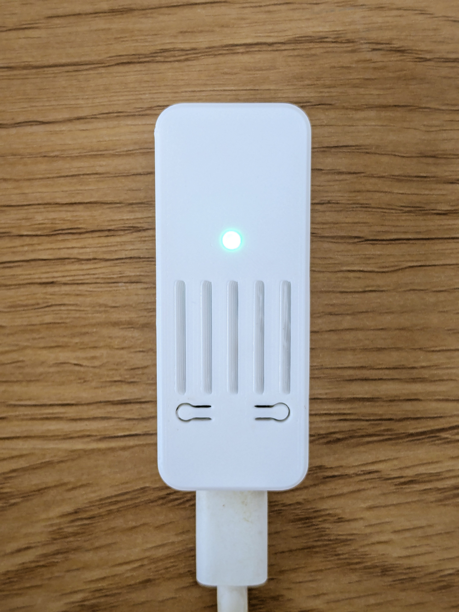
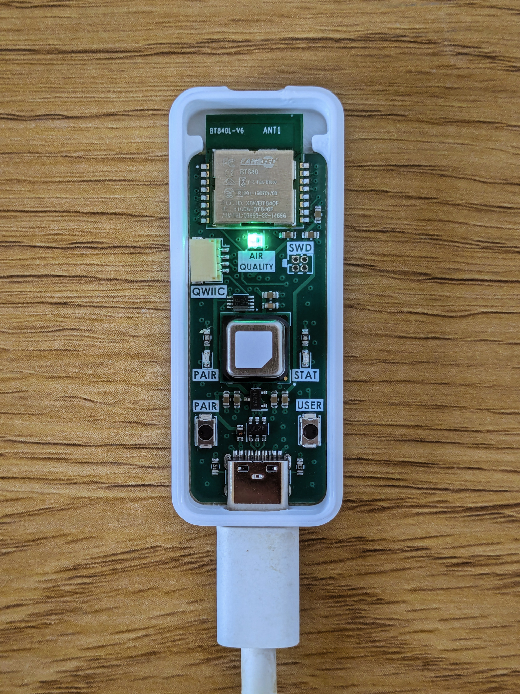

# Zigbee air quality monitor firmware
Opensource HA compatible air quality monitor with CO2, temperature and humidity measurements.\
Based on **nRF Connect SDK v2.2.99**.




## Usage
Left button press - Triggers Zigbee network steering or LED indication (if connected to Zigbee network).\
Left button long press (>1sec) - Factory reset.

Right button press - Toggles RGB LED air quality indication.\
Right button long press (>1sec) - Triggers forced CO2 recalibration of SCD40 sensor.

## Init west workspace (automatic)
Use nRF Connect for VS Code extension.
And only apply the patches manually:
```bash
./apply_patches.sh
```

## Init west workspace (manual)
```bash
cd /workdir
ZEPHYR_BASE="" west init -l /workdir/project/
west update
cd ./project
./apply_patches.sh
```

## Building
`west build -b xiao_ble`

## Flashing
`west flash --runner blackmagicprobe`

## Debugging
GDB:\
`west debug --runner blackmagicprobe`

Or you can use this `./.vscode/launch.json` config for Cortex-Debug extension:
```json
{
    "version": "0.2.0",
    "configurations": [
        {
            "name": "Zephyr nRF52840",
            "cwd": "${workspaceFolder}",
            "request": "launch",
            "type": "cortex-debug",
            "servertype": "bmp",
            "BMPGDBSerialPort": "/dev/ttyACM0",
            "armToolchainPath": "${workspaceFolder}/../zephyr-sdk/arm-zephyr-eabi/bin",
            "gdbPath": "${workspaceFolder}/../zephyr-sdk/arm-zephyr-eabi/bin/arm-zephyr-eabi-gdb",
            "interface": "swd",
            "runToEntryPoint": "main",
            "showDevDebugOutput": "raw",
            "executable": "${workspaceFolder}/build/zephyr/zephyr.elf",
            "preLaunchCommands": [
                "add-symbol-file ${workspaceFolder}/build/zephyr/zephyr.elf"
              ]
        },
    ]
}
```
